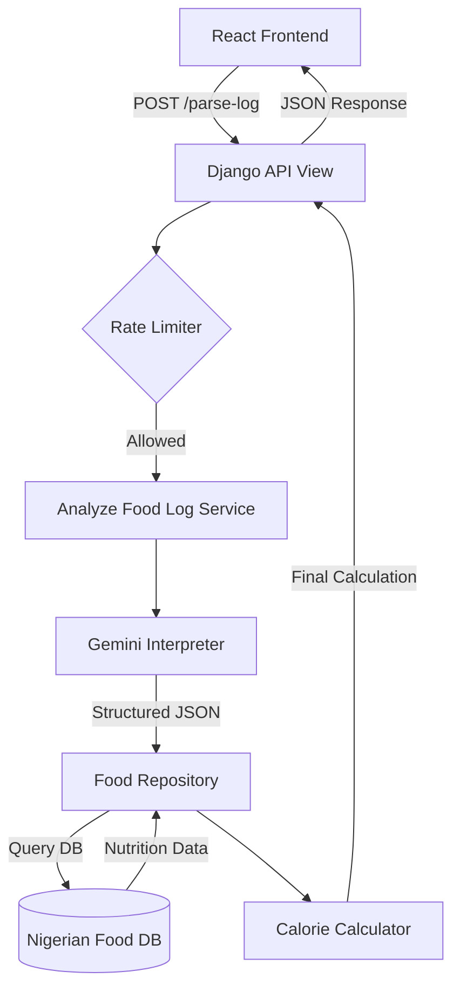

# 📖 NaijaCal - AI Nigerian Calorie Tracker

NaijaCal is a full-stack engineering solution designed to solve the "local context" problem in nutrition tracking. While global calorie apps often fail to recognize specific Nigerian meals and portions, NaijaCal leverages a **Large Language Model (LLM)** and a curated local database to provide accurate, natural-language calorie estimates.

---

## ✨ Features

- 🧠 **AI-Powered Parsing**: Processes free-form text like *"I had two wraps of eba and a bowl of egusi"* into structured data.
- 🇳🇬 **Domain Specificity**: Optimized for Nigerian cuisine, identifying items from Jollof rice to Amala.
- 🛡️ **Production Resilience**: Implements API key rotation across multiple provider keys and IP-based rate limiting.
- 🐳 **Containerized Architecture**: Fully Dockerized for consistent development and deployment.
- ⚡ **Layered Backend**: Clean separation between AI interpretation, database enrichment, and deterministic calorie math.

---

## 📦 Technologies

- **Backend**: Python 3.11, Django 5, Django REST Framework.
- **AI Engine**: Advanced Large Language Model (LLM) integration.
- **Database**: PostgreSQL (Production) / SQLite (Local).
- **Frontend**: React 19, CSS3 (Vanilla).
- **DevOps**: Docker, Docker Compose.

---

## 🔗 Component Flow



---

## 🗂️ Repository Structure

- **`backend/api/`**: The core application logic.
    - **`domain/`**: Contains `calorie_calculator.py`—the source of truth for all nutritional mathematics.
    - **`services/`**: 
        - `gemini_service.py`: Handles AI orchestration, key rotation, and error retries.
        - `food_interpreter.py`: Validates and cleans model outputs.
        - `rate_limit_service.py`: Manages anonymous trial quotas.
    - **`repositories/`**: `food_repository.py` handles the data-mapping layer between AI items and database entries.
    - **`views/`**: Clean API entry points.
- **`frontend/`**: A modern React SPA designed for a mobile-first "Log and See" experience.
- **`docker-compose.yml`**: Defines the multi-container environment (App + DB).

---

## 🚀 Installation

1. **Clone the Repository**:
   ```bash
   git clone https://github.com/sethnwoks/Health_App.git
   cd Health_App
   ```

2. **Configure Environment**:
   Create a `.env` in `backend/` and add your AI API key:
   ```env
   GEMINI_API_KEY_1=your_key_here
   DEBUG=True
   ```

3. **Launch with Docker**:
   ```bash
   docker compose up --build
   ```

---

## 🛠️ Usage

Once the app is running:
1. Navigate to `http://localhost:3000`.
2. Enter your meal log: *"Breakfast: 2 slices of bread and 2 eggs"*.
3. Click **Calculate Calories** to see the instant breakdown.

---

## 🔧 Configuration & Requirements

- **Requirements**: Docker & Docker Compose installed.
- **Environment Variables**:
    - `DATABASE_URL`: Automatic fallback to SQLite if not provided.
    - `AUTH_ENABLED`: Set to `True` to enable JWT registration flows (currently under review).
    - `CORS_ALLOWED_ORIGINS`: Configure this for production frontend deployment.

---

## 📝 Changelog

- **v1.0.0**: Initial release with LLM integration.
- **v1.1.0**: Migrated from Flask prototype to Django for enterprise-grade scalability.
- **v1.2.0**: Implemented layered architecture (Service/Repository pattern).
- **v1.3.0**: Added multi-key rotation and Dockerized PostgreSQL support.
- **v1.4.0**: Optimized for Anonymous Trial Mode with IP-based rate limiting.

---

## 🤝 Contributing
Contributions are welcome! Please fork the repository and use a feature branch. Pull requests should follow the existing architectural patterns.

## ❤️ Acknowledgements
- **LLM Providers** for the high-speed inference models.
- **Nigerian Food Datasets** for the foundational nutritional benchmarks.
